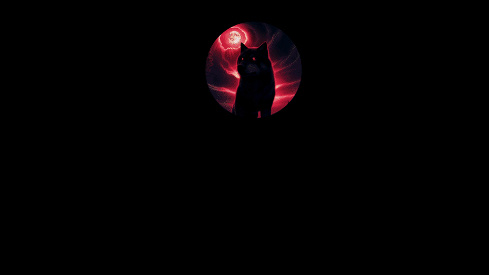

  

  <h1>🩸 CAIQUE DE OLIVEIRA SOUZA</h1>
  
  
<i>Digital Content Creator, Streamer & Developer</i>

  

    
    
  

---

### ☠️ Sobre o Desenvolvedor

Atuo na intersecção entre o gerenciamento de comunidades digitais, criação de conteúdo e o desenvolvimento de software. Especializado em lógica, estruturação de fluxos operacionais e **arquitetura de automações**. Desenvolvo sistemas robustos de integração de dados, bots de moderação de alta performance e ecossistemas automatizados voltados para o engajamento e gerenciamento de clãs e plataformas de streaming.

- ⚙️ **Foco de Engenharia:** Desenvolvimento back-end, lógica de automação, manipulação dinâmica de planilhas e APIs de bots.
- 🎨 **Estética de Código:** Ambientes otimizados de alta performance sob a identidade visual *dark/cyberpunk*.
- ⚔️ **Liderança Digital:** Administrador principal da infraestrutura técnica e de automações da **Tropa Do CaOS**.

---

### 🛠️ Arsenal Técnico & Ferramentas

#### 🔴 Linguagens & Core Web

  
  
  

#### 🔴 Automação, Bots & Workflow

  
  
  

#### 🔴 Controle, Design & Versionamento

  
  
  
  

---

### 📂 Diretório de Repositórios & Projetos Focados

Navegue diretamente pelos módulos de desenvolvimento ativos no meu perfil:

* 🌌 **[Todos os Repositórios Públicos](https://github.com/caiqueDeOliveira-dev?tab=repositories)** — Código fonte dos meus projetos, scripts e interfaces em constante atualização.
* 🤖 **[Configurações de Automação & Bots](https://github.com/caiqueDeOliveira-dev)** — Estruturas criadas para gerenciar disparos de webhooks, lógica de distribuição de itens em bancos de dados e regras automatizadas para comunidades.

---

### 📊 Painel de Controle (Automação de Métricas em Tempo Real)

Este painel monitora e computa automaticamente o envio de códigos, o tempo de atividade e a distribuição de linguagens de programação integradas diretamente ao ecossistema através de requisições de API assíncronas do GitHub.

  
  

   
  

---

### 🌐 Conexões de Rede (Links Oficiais)

Escolha uma das portas abaixo para estabelecer conexão externa direto do ecossistema CaOS:

  
  
  
  

 

  

